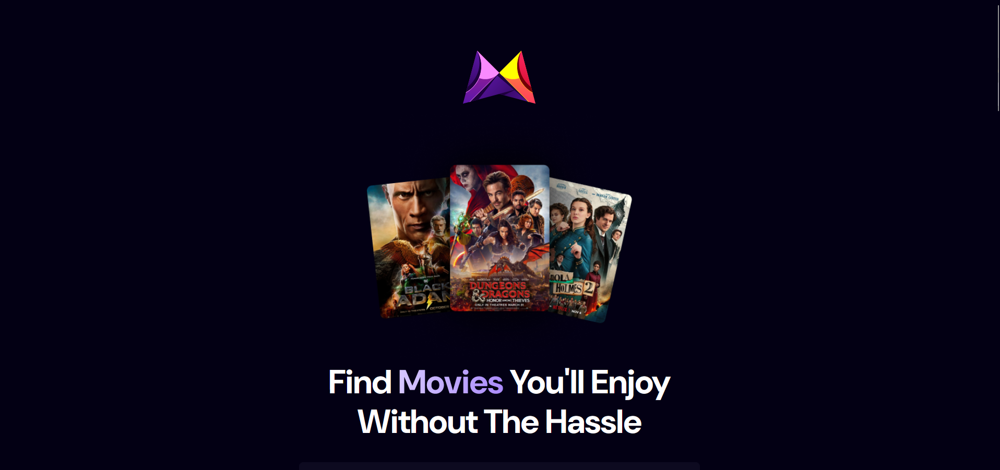

# Moodflix

Search movies 1000s of movies available on the platform and see what trending movies are out there based on a dynamic algorithm.

**Link to project:** https://moodflix.henry-arb.com/

## How It's Made:

**Tech used:** HTML, CSS, JavaScript, React, Tailwind, Appwrite

The application mainly utilizes React for the frontend with styling applied using Tailwind CSS. The backend is provided by Appwrite which contains the data needed for the dynamic trending algorithm.

## Optimizations

Utilized a debouncer for the search input to reduce uneccessary API calls to provide a much smoother application experience for the user and prevent exceeding API rate limits.

## Lessons Learned:

This project mainly taught me more about how the various hooks in react can be utlized to optimize application performance. I also learned how to handle API calls using promises and lastly I learned how to properly implement a debouncer which helps with preventing excessive API calls.
